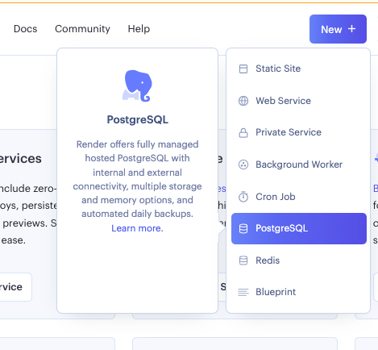

#  Deploying
## Learning Goals
* Demonstrate How to Deploy an Application Using "Render"
* Provide Step-by-Step Instructions That Students can Follow When Deploying Their Own Applications

# 📚 Review With Students: 
* Defining a Web Server 
* Application Environment 
    * Development vs. Testing vs. Production
* Picking a PaaS
    * Heroku
    * AWS
    * Digital Ocean
    * Render
 
# Set Up:
# PostgresSQL Installation (Mac)
  * `brew install postgresql`
  * `brew services start postgresql`
# PostgresSQL Installation (Windows)
  * `sudo apt update`
  * `sudo apt install postgresql-contrib libpq-dev`
  * `psql --version`
  * `sudo service postgresql start`
  * `whoami`
  * `sudo -u postgres -i`
  * `createuser -sr <your_user_name>`
  * `logout` to exit

### GitHub 
  1. ✅ On GitHub, create a new repository named flatiron_theater_deployment_<cohort_number>.

### Create a Local Repository
  2. ✅ Outside of the course repo, create a new local directory `mkdir theater_app`   
  * 2.1 Copy the solution code from the previous lecture into the new directory

### Configure Application 
  3. ✅ If missing, add any of the following libraries to the pipfile `python-dotenv` `gunicorn` `psycopg2-binary` `flask-SQLAlchemy` `flask-migrate` `SQLAlchemy-Serializer` and `flask-RESTful` 
  * 3.1 Create a requirements.txt with `pipenv requirements > requirements.txt`
  * 3.2 Create a .evn file 
  * 3.3 In app add `import os` and `from dotenv import load_dotenv` set app.config['SQLALCHEMY_DATABASE_URI'] os.environ.get('DATABASE_URI') 

### Render PostgreSQL
  4. ✅ Create an account on Render 
  * 4.1 Select 'New' and then PostgreSQL from the dropdown  
      
  * 4.2 Name your PostgreSQL database, and set the PostgreSQL Version to 15 (or newer). The region should auto-select. Verify you've selected the Free instance and click Create Database.

### Connect your local Database to Render 
  5. ✅ Navigate to your new Database from the Render Dashboard.    
  * 5.1 In the top right, select the connect dropdown. Select the External Connection Tab and copy the PSQL command. 
  *    
  * 5.2 Paste the command in your terminal.  
  * From here, you can run PSQL commands [PSQL command cheetsheet](https://postgrescheatsheet.com/#/tables)
  * 

### Connect your app to your Render DB
  6. In the .env file add an environment variable `SQLALCHEMY_DATABASE_URI`
  * 6.0 If it doesn’t exist, create a .env file in the root directory of your app.
  * 6.1 Return to your render DB In the top right, select the connect dropdown. Select the External Connection Tab and copy the url. Modify the section of the protocol which reads `postgres://` to `postgresql://`
  * 6.2 Set the environment variable to the connection url 
  * Note: If you have a secret key for sessions, 3rd party api keys or any other secure variables now would be a great time to add them to the .env

### Build the React Client
  7. Start to build out the React Client with at least one component that a request to the test route you built for your backend. 
  * Note: Note: Your React app and server should be in the same directory. The root directory structure should look like this.
    |- client 
    |- server
    |- .env
    |- .gitignore
    |- Pipfile
    |- Pipfile.lock
    |_ requirements.tx

### Create a static react app.
  8. In your client’s package.json add a proxy server `"proxy": "http://localhost:5555"`
  * 8.1 Remove `http://localhost:5555/` from any of your fetch requests but keep the endpoint. For example: A GET all to productions should only be passed the end point ‘/productions as the url. 
  * 8.2 In the root directory of your app run ` npm install --prefix client`
  * 8.3 Run `npm run build --prefix client`
  * Note: You’ll notice there’s a new build folder in the client folder. This is your static app

### Configure your Client routes
  9.  Our web API will interfere with our routes from react-router, so we must handle them on our server. In `app.py` add 
  ```
    app = Flask(
        __name__,
        static_url_path='',
        static_folder='../client/build',
        template_folder='../client/build'
    )
    @app.route('/')
    @app.route('/<int:id>')
    def index(id=0):
        return render_template("index.html")

  ```

### Migrate and test the app
  10. Migrate your database 
  * 10.1 
    ```
    flask db init
    flask db revision --autogenerate -m ‘Create tables’
    flask db upgrade
  ```
 *  Test your app locally to make sure it works by running `gunicorn --chdir server app:app`


### Commit your app to GitHub
 >Note: It’s a good idea to commit and deploy your project from the very beginning. Use GitHub to control and track your changes and use your deployment to verify your new features continue to will work once deployed.
 11. ✅ run `git init` in the local repo for your app.  
   * 11.1 Set your local repo to push to your Gethub repo `git add remote origin <github repo url>`
     > Note: If you need to change to a different Github repo use `git remote set-url origin <github repo url>`
   * 11.2 Push your code GitHub
   ```
    git add .
    git commit -m ‘first commit!’
    git push origin main 
   ```
### Create a new web service on Render
  12. ✅ From the render Dashboard, select 'New' and 'Web Service' from the dropdown menu
  * 12.1 Connect your repository 
  * 12.2 Name your Web Service and change the start command to `gunicorn --chdir server app:app`
  * 
  * 12.3. Click advanced and Add 2 Environment Variables 
     *  PYTHON_VERSION : <your python version>
     *  DATABASE_URI: <your render internal db url. However, replace postgres with postgresql>
  * Hit create and get a snack
  * Once deployed, the deployment url will be at the top Right of the the Web Service page. go to `<your url>/productions` to test your backend deployment. 